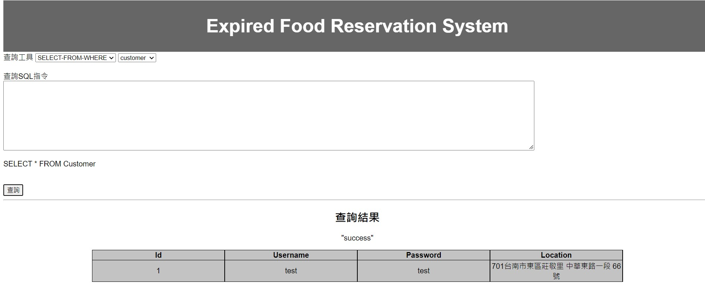
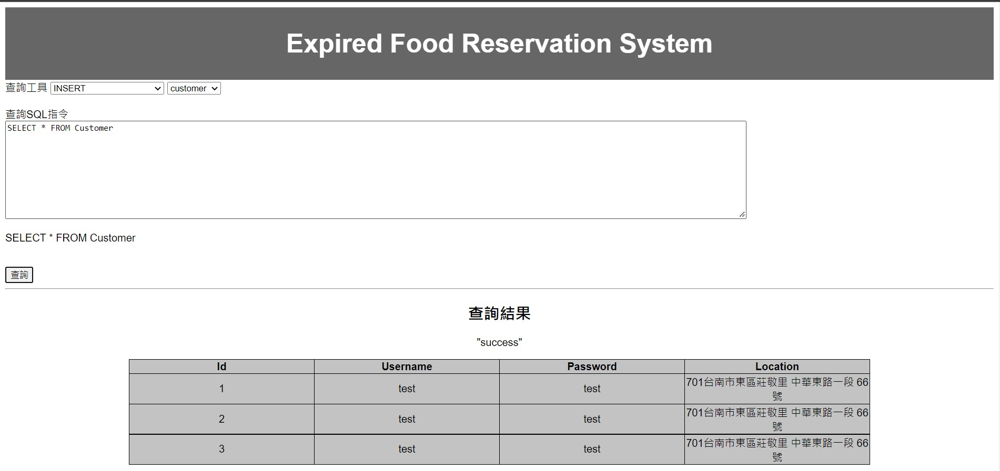
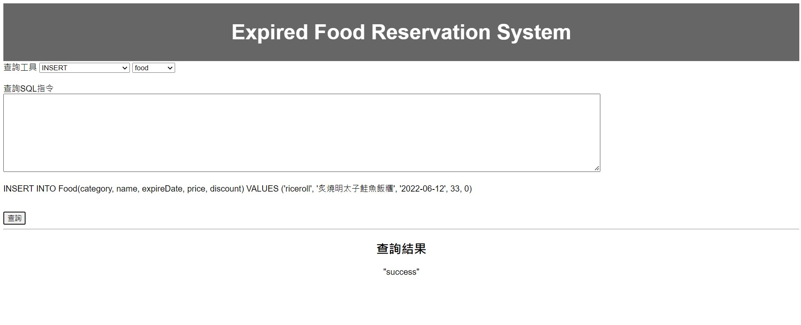
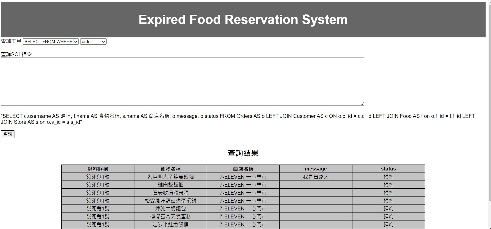
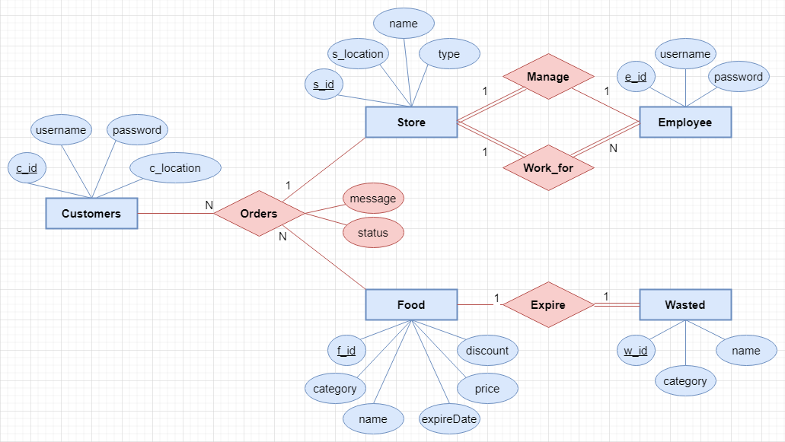
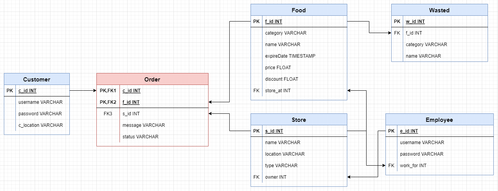

# DBMS Final Project

資料庫系統導論期末 Project: Expired Food Reservation System (EFRS)

## 系統簡介

## 系統架構與環境

- Programming Language：Golang
- Database：SQLite3
- Environment：Windows 10

## 介面截圖









## 使用說明

Prerequisites

- Golang

1. Run backend server

    ```shell
    cd backend

    go run .
    ```

2. Open frontend(`index.html`)

## 資料庫設計

因應各個便利商店為了減少食物浪費，推出友善時光折扣等等對於即期食品的優惠。

然而透過各大APP瀏覽各個店內即期食品的資訊(種類、數量)和實際到店時的情況，會因為Travel Time導致想要買的食品被搶先購走了，因此，本系統目的就在於能透過預約的方式購買這些即期食品，並整合各個便利商店，讓消費者能直接透過本系統瀏覽鄰近便利商店的即期食品資訊，進而更人性化的降低食物的浪費。

### ER Diagram



### Relation Schema



### Table、Attribute、Relationship 說明

- **`Customer`**：紀錄本系統註冊之顧客資訊。
  - `c_id`：**Primary Key**，customer的id(unique)。
  - `username`：顧客註冊帳號。
  - `password`：顧客註冊密碼。
  - `c_location`：顧客當前位置。
- **`Employee`**：紀錄每家商店的員工。
  - `e_id`：**Primary Key**，employee的id(unique)。
  - `username`：員工帳號。
  - `password`：員工密碼。
  - `work_for`:在哪間商店上班->`Store.s_id`。
- **`Store`**：紀錄商店資訊。
  - `s_id`：**Primary Key**，商店的id(unique)。
  - `s_location`：商店的位址。
  - `name`：商店名稱。
  - `type`：商店種類，例如7-11、全家、麵包店...。
  - `owner`：經理是哪位->`Employee.e_id`。
- **`Food`**：紀錄所有登入之食物。
  - `f_id`：**Primary Key**，食物的id(unique)。
  - `category`：食物的種類，例如飯糰、麵包...。
  - `name`：食物的名稱。
  - `expireDate`：食物有效期限。
  - `price`：販售價格。
  - `discount`：即期優惠。
  - `store_at`：販售在哪間商店->`Store.s_id`。
- **`Wasted`**：紀錄所有被浪費掉的食物。
  - `w_id`：**Primary Key**，Wasted的id(unique)。
  - `f_id`：Food的id(unique)->`Food.f_id`。
  - `category`：食物的種類，例如飯糰、麵包...。
  - `name`：食物的名稱。
- **`Orders`**：即期食品的預約訂單。
  - `c_id`：**Primary Key**，顧客的id(unique)->`Customer.c_id`。
  - `f_id`：**Primary Key**，食物的id(unique)->`Food.f_id`。
  - `s_id`：商店的id(unique)->->`Store.s_id`。
    - `(c_id,f_id)`為composite PK。
  - `message`：顧客於此訂單之留言。
  - `status`：此訂單交易狀態，`預約`、`取消`、`結單`。

### Embedded SQL 說明

1. **SELECT-FROM-WHERE**
   - Customer：查詢所有顧客資訊
  
      ```sql
      SELECT * FROM Customer
      ```

   - Employee：查詢所有員工資訊
  
      ```sql
      SELECT * FROM Employee
      ```

   - Food：查詢所有食物資訊
  
      ```sql
      SELECT * FROM Food
      ```

2. **DELETE**
    - Customer：顧客刪除帳號

      ```sql
      DELETE FROM Customer WHERE c_id=1;
      ```

3. **INSERT**
   - Customer：新顧客註冊

      ```sql
      INSERT INTO customer (username, password, c_location) VALUES ('test', 'test', '701台南市東區莊敬里 中華東路一段 66號');
      ```

4. **UPDATE**
   - Customer：顧客更新當前GPS位置

      ```sql
      UPDATE Customer SET c_location='701台南市東區大學路1號' WHERE c_id = 1;
      ```

5. **IN**
   - Food：查詢在商店1中飯糰和麵包類的所有食物

    ```sql
      SELECT * FROM Food WHERE category IN ('riceroll','bread') AND store_at = 1
    ```

6. **NOT-IN**
   - Food：查詢在商店1中尚未被預約的所有食物

    ```sql
      SELECT * FROM Food WHERE f_id NOT IN (SELECT f_id FROM Orders) AND store_at = 1
    ```

7. **EXISTS**
   - Food：查詢在商店1中已經被預約的所有食物

    ```sql
      SELECT * FROM Food WHERE EXISTS (SELECT f_id FROM Orders WHERE Orders.f_id=Food.f_id)
    ```

8. **NOT-EXISTS**
   - Food：查詢在商店1中尚未預約的所有食物

    ```sql
      SELECT * FROM Food WHERE NOT EXISTS (SELECT f_id FROM Orders WHERE Orders.f_id=Food.f_id )
    ```

9. **COUNT**

   - Orders：查詢在商店1的訂單個數

    ```sql
      SELECT COUNT(*) FROM Orders WHERE s_id = 1
    ```

10. **SUM**

    - Orders：查詢顧客1的所有訂單金額

      ```sql
      SELECT SUM(f.price) AS price FROM Orders AS oLEFT JOIN Food AS f ON o.f_id = f.f_id WHERE o.c_id = 1
      ```

11. **MAX**

    - Food：查詢在所有商店尚未預約食物最多的商店

      ```sql
      SELECT name,MAX(left_food) AS num_left_food 
      FROM ( 
        SELECT Store.name AS name, COUNT(store_at) AS left_food 
        FROM Food 
        LEFT JOIN Store ON Food.store_at = Store.s_id 
        GROUP BY store_at 
        )
      ```

12. **MIN**

    - Food：查詢在商店1中目前最接近保存期限的食物

      ```sql
      SELECT Food.f_id, Food.name, MIN(expireDate) AS expiredDate FROM Food WHERE store_at = 1
      ```

13. **AVG**

    - Food：查詢在商店1中飯糰的平均價格

      ```sql
      SELECT category, AVG(price) as price FROM Food WHERE category="riceroll"
      ```

14. **HAVING**

    - Food：查詢在所有商店中剩餘食物個數大於5的商店

      ```sql
      SELECT s.name, COUNT(f_id) AS num_food_left
      FROM Food AS f
      LEFT JOIN Store AS s ON f.store_at = s.s_id
      GROUP BY store_at
      HAVING COUNT(f_id) > 5
      ```
